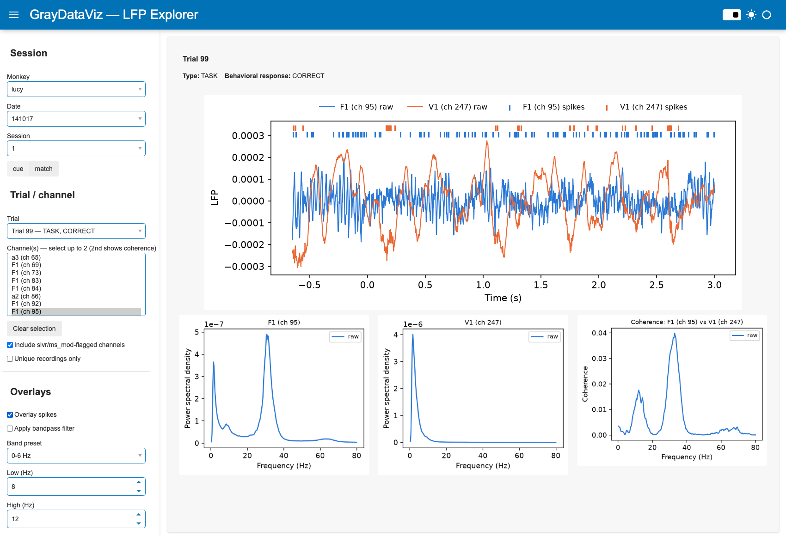

# GrayDataViz

Data loading and visualization toolkit for the Gray Lab primate LFP dataset,
replacing the loading code duplicated across `GrayData-Analysis` (`GDa/`) and
`phase_coupling_analysis` (`src/`).

Phase 1 is a standalone, tested loading API. Phase 2 is a Panel-based GUI for
browsing raw LFP recordings, comparing two channels, and inspecting their
power spectra and coherence — all computed with the same multitaper
parameters (`bandwidth`, `fmin`, `fmax`) as `phase_coupling_analysis`.

## GUI



*Monkey lucy, date 141017, trial 99 (TASK, CORRECT), channels F1 (ch 95) and
V1 (ch 247) with spikes overlaid — LFP traces on top, then each channel's
power spectrum and their coherence below, all averaged over every trial in
the session.*

- **Session picker**: monkey → date → session → cue/match alignment, all
  auto-discovered from disk (see [Loading API](#loading-api) below).
- **Trial**: pick any trial; the dropdown shows its type and behavioral
  response inline (e.g. "Trial 99 — TASK, CORRECT").
- **Channel(s)**: select **one or two** channels from the multi-select
  (`Clear selection` resets it). One channel shows its LFP trace and power
  spectrum. Two channels overlay both LFP traces in one plot and add a
  coherence panel between their two power spectra.
- **Include slvr/ms_mod-flagged channels** / **Unique recordings only**:
  toggle the two channel-filtering behaviors `load_session` supports, instead
  of them being silently baked in.
- **Overlay spikes**: adds each channel's spike raster (tick marks) above its
  trace, in that channel's own color.
- **Apply bandpass filter**: pick a per-monkey band preset (from
  `phase_coupling_analysis/config.py`'s `bands`) or a custom range. When
  enabled, the filtered signal **replaces** the raw one everywhere (trace,
  power spectra, coherence) rather than overlaying both.
- **Power spectra and coherence use every trial** in the session for the
  selected channel(s) — not just the one currently selected for the raw
  trace — matching how `xr_psd_array_multitaper`/`conn_spec_average` are
  actually used in the pipeline. Results are cached per channel/filter
  selection so switching trials or toggling spikes stays fast.

Run it with:

```bash
pip install -e ".[gui]"        # panel, matplotlib, mne
graydataviz-gui
# or
python -m graydataviz.app
```

By default it points at `DataConfig()` (`GRAYDATAVIZ_RAW_ROOT` /
`GRAYDATAVIZ_RESULTS_ROOT`, or `~/funcog/gda/GrayLab` / `~/funcog/gda/Results`
if unset). Set those env vars to point at wherever the raw data actually
lives before launching.

## Sharing the GUI over the internet

For letting others try the GUI without giving them the raw data, without
paying for cloud infra, and without exposing more of the dataset than
intended:

1. **Scope the data** the server can see to just what you want to share, via
   a separate raw-data root containing only symlinks to the sessions you're
   sharing (`discovery.py` only reports what's actually reachable under
   `raw_root`, so this is a filesystem-level guarantee, not an app-level one):

   ```bash
   mkdir -p /path/to/GrayLab_demo/lucy
   ln -s /path/to/real/GrayLab/lucy/141017 /path/to/GrayLab_demo/lucy/141017
   ```

2. **Add basic auth** when serving, so the URL alone isn't enough to get in.
   `pn.serve` takes `basic_auth` (a `{username: password}` dict) and requires
   a `cookie_secret`:

   ```python
   import secrets
   import panel as pn
   from graydataviz.app import build_app

   pn.serve(
       build_app,
       port=5679,
       address="localhost",
       basic_auth={"viewer": "<a real password>"},
       cookie_secret=secrets.token_urlsafe(32),
       websocket_origin=["<your-public-hostname>", "localhost:5679"],
   )
   ```

   `websocket_origin` must include whatever public hostname you'll expose —
   Bokeh's websocket layer rejects connections from origins it doesn't know
   about by default (the symptom is the page loading its header/chrome but
   never rendering any widgets or plots).

3. **Expose it** with a free Cloudflare quick tunnel (no account needed):

   ```bash
   brew install cloudflared
   cloudflared tunnel --url http://localhost:5679
   ```

   This prints a random `https://<words>.trycloudflare.com` URL that proxies
   to your local server. Caveats: it only works while your machine and the
   `pn.serve`/tunnel processes are running, the URL is random and changes if
   the tunnel restarts, and Cloudflare gives no uptime guarantee for these
   account-less tunnels — fine for sharing a quick look, not for something
   depended on long-term. For that, a real (paid) VM or PaaS host with a
   fixed domain would be the next step.

Only static images ever reach the browser — every plot is rendered
server-side to a PNG (`pn.pane.Matplotlib`, not a Bokeh-native chart), so
there's no numeric data embedded in the page for someone to extract via
dev tools, and the app has no export/download endpoint.

## Loading API

- **Filesystem auto-discovery** instead of hard-coded per-monkey date lists:
  `list_monkeys()`, `list_dates(monkey)`, `list_sessions(monkey, date)` scan the
  raw data root and only report sessions that actually have both
  `recording_info.mat` and `trial_info.mat` present.
- **Configurable root paths** via `DataConfig` (constructor args or the
  `GRAYDATAVIZ_RAW_ROOT` / `GRAYDATAVIZ_RESULTS_ROOT` env vars) instead of
  paths baked into module-level globals.
- **One `xr.Dataset`** (`load_session`) with `"lfp"` and optional `"spikes"`
  data variables sharing a single `attrs` dict, instead of two `DataArray`s
  with the metadata dict duplicated between them.
- **Per-monkey/alignment trial windows** (`windows.py`) resolved automatically
  from `(monkey, align_to)`, matching `phase_coupling_analysis/config.py`'s
  `return_evt_dt` — using one monkey's window on another's data can slice past
  the end of its shorter recordings.
- **Typed trial vocabulary** (`TrialType`, `BehavioralResponse` enums) instead
  of bare integer codes.
- **Descriptive errors**: missing raw/derived files raise
  `RawDataNotFoundError` / `DerivedDataNotFoundError` naming the exact path
  (and, for derived products, what files *are* present in that directory)
  instead of a bare `FileNotFoundError` from deep inside `xarray`/`h5py`.

```python
from graydataviz import DataConfig, list_dates, load_session, load_power, TrialType

config = DataConfig()  # or DataConfig(raw_root=..., results_root=...)

dates = list_dates("lucy", config=config)

ds = load_session("lucy", dates[0], align_to="cue", config=config)
task_trials = ds.sel(trials=ds.lfp.trials)  # or use filter_trial_indexes()

power = load_power("lucy", dates[0], trial_type=TrialType.TASK, config=config)
```

## Install

```bash
python -m venv .venv && source .venv/bin/activate
pip install -e ".[dev]"       # loading API + tests
pip install -e ".[gui]"       # + panel/matplotlib/mne, to also run the GUI
```

## Layout

```
src/graydataviz/
├── config.py     # DataConfig: raw_root / results_root, path conventions
├── discovery.py  # list_monkeys / list_dates / list_sessions
├── io.py         # low-level .mat (legacy + HDF5) readers
├── metadata.py   # SessionMetadata: recording_info + trial_info
├── trials.py     # TrialType / BehavioralResponse, filter_trial_indexes
├── windows.py    # per-monkey/alignment default trial time windows
├── session.py    # load_session: raw LFP + spikes -> xr.Dataset
├── derived.py    # load_power / load_pec_strength / load_crackle_cooccurrence / load_burst_probability
├── stimuli.py    # get_stimulus_image / get_stimulus_name (from embedded image_data)
├── filters.py    # bandpass_filter (zero-phase Butterworth), per-monkey DEFAULT_BANDS
├── app.py        # Panel GUI (build_app / main): LFP trace, multitaper power spectra, coherence
└── exceptions.py
```

## Tests

Tests build small synthetic `.mat`/HDF5/NetCDF fixtures on the fly (see
`tests/conftest.py`) so the suite runs without access to the real dataset:

```bash
pytest
```
