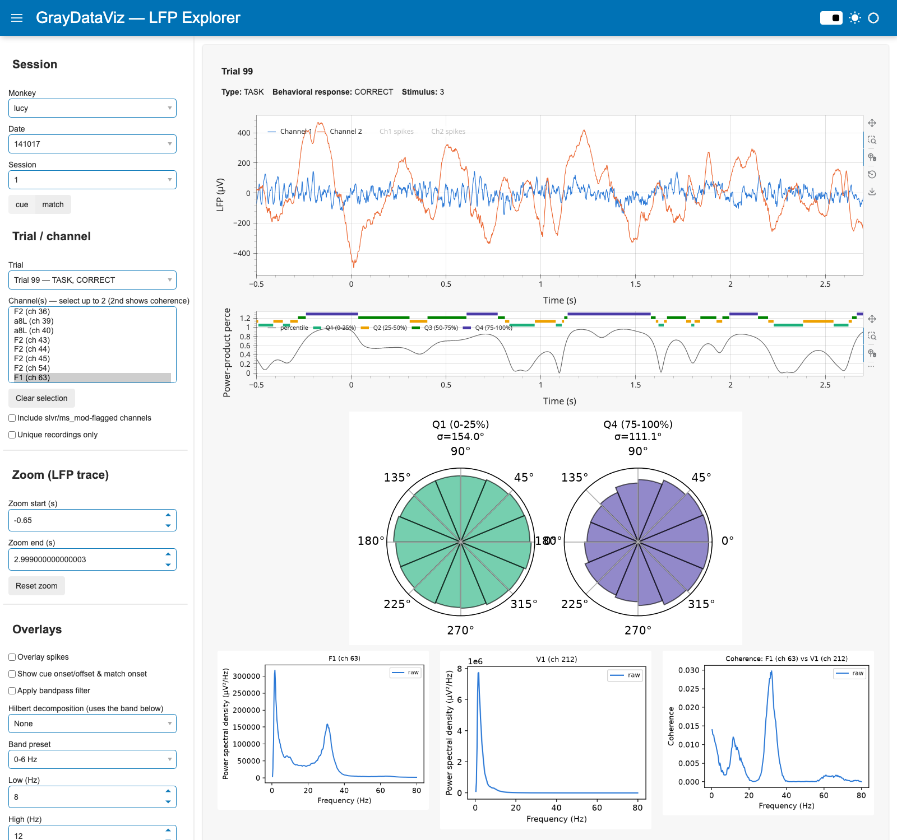

# GrayDataViz

Data loading and visualization toolkit for the Gray Lab primate LFP dataset,
replacing the loading code duplicated across `GrayData-Analysis` (`GDa/`) and
`phase_coupling_analysis` (`src/`).

Phase 1 is a standalone, tested loading API. Phase 2 is a Panel-based GUI for
browsing raw LFP recordings (in µV, mouse-zoomable), comparing two channels,
and inspecting their power spectra, coherence, Hilbert envelope/phase,
spike-triggered average, phase-amplitude coupling, spike-phase locking, and
power-product quantile/phase-difference regions — all computed with the same
multitaper/Hilbert parameters as `phase_coupling_analysis` where an
equivalent exists there.

## GUI


*Monkey lucy, date 141017, trial 99 (TASK, CORRECT), channels F1 (ch 95) and
V1 (ch 247) with spikes overlaid — LFP traces on top, then each channel's
power spectrum and their coherence below, all averaged over every trial in
the session.*

- **Session picker**: monkey → date → session → cue/match alignment, all
  auto-discovered from disk (see [Loading API](#loading-api) below).
- **Trial**: pick any trial; the dropdown shows its type and behavioral
  response inline (e.g. "Trial 99 — TASK, CORRECT"), and the info line above
  the LFP trace adds the trial's stimulus id (raw `sample_image` value from
  `trial_info`, 1-5, or N/A for fixation trials).
- **Channel(s)**: select **one or two** channels from the multi-select
  (`Clear selection` resets it). One channel shows its LFP trace and power
  spectrum. Two channels overlay both LFP traces in one plot and add a
  coherence panel between their two power spectra.
- **Include slvr/ms_mod-flagged channels** / **Unique recordings only**:
  toggle the two channel-filtering behaviors `load_session` supports, instead
  of them being silently baked in.
- **Overlay spikes**: adds each channel's spike raster (tick marks) above its
  trace, in that channel's own color.
- **Show cue onset/offset & match onset**: draws vertical reference lines at
  the selected trial's `sample_on`/`sample_off`/`match_on` times, converted to
  the same relative-to-alignment seconds as the plotted trace (no
  `match_off`/offset field exists in `trial_info`).
- **Apply bandpass filter**: pick a per-monkey band preset (from
  `phase_coupling_analysis/config.py`'s `bands`) or a custom range. When
  enabled, the filtered signal **replaces** the raw one everywhere it's used
  as a per-trial trace (LFP trace, power spectra, coherence, spike-triggered
  average) rather than overlaying both.
- **Hilbert decomposition**: envelope and/or instantaneous phase (band-filter
  then `scipy.signal.hilbert`, matching `phase_coupling_analysis`'s
  `hilbert_decomposition`), using the band controls above, shown as its own
  panel(s) below the LFP trace.
- **Additional analyses** (each usable with one or two channels selected,
  pooled across every trial in the session):
  - **Spike-triggered average (µV)** — mean LFP waveform in a ±0.25s window
    around each spike, computed on the filtered signal instead of raw when
    the bandpass filter above is enabled (same "filtered replaces raw" rule).
    Unlike the quantile/phase-difference panels below, this pools the *full*
    trial window (no -0.5s-to-match-onset trim) — there's no evidence the
    reference pipeline restricts STA that way, that trim is specific to
    `save_burst_trains.py`'s burst-detection logic.
  - **Phase-amplitude coupling (Tort MI)** — the standard Tort et al. (2010)
    modulation index between an independently configurable phase band and
    amplitude band, shown as a phase-binned mean-amplitude histogram.
  - **Spike-phase locking** — phase (in the band configured above) at every
    spike, as a histogram plus the mean resultant length (vector strength).
  - **Power-product quantile regions** (two channels only) — each channel's
    Hilbert envelope power (in the band configured above) is multiplied
    together, percentile-ranked across every trial in the session, and split
    into quartiles (Q1-Q4), reproducing the burst-detection method from
    `phase_coupling_analysis/save_burst_trains.py`: only samples from -0.5s
    through each trial's own match onset count toward the thresholds (the
    padding beyond that, present in every other panel here, is excluded —
    matching `trials_length_mask` there, not just the exploratory
    `Phase_Analysis-Method_Sumary` notebook). A linked panel below the LFP
    trace plots the selected trial's percentile trace plus which quartile it
    falls in at each timepoint, evaluated against those thresholds even for
    trials/times outside that window.
  - **Phase-difference circular plot** (two channels only) — pick one or more
    of those same quartiles and see the two channels' instantaneous phase
    difference, pooled across every trial (same -0.5s-to-match-onset window
    as above) and restricted to samples in that power-product quartile, as
    an area-true circular histogram (bin *area*, not radius, encodes
    frequency — see `plot_.py`'s `circular_hist`) with the circular mean and
    standard deviation in its title. The two channels are always ordered
    alphabetically by `{roi}_{channel}` before subtracting phases (`phase(A)
    - phase(B)`, stated above the plot) to match
    `phase_coupling_analysis/src/metrics/phase.py`'s pairing convention —
    picking the same two channels in the opposite order in the selector
    doesn't change anything, since std is sign-symmetric but the mean/the
    histogram's orientation would otherwise flip depending on click order.


- **Power spectra, coherence, and the additional analyses all use every
  trial** in the session for the selected channel(s) — not just the one
  currently selected for the raw trace — matching how
  `xr_psd_array_multitaper`/`conn_spec_average` are actually used in the
  pipeline. Results are cached per channel/filter/band selection so switching
  trials or toggling spikes stays fast.
- **Trial subset for those pooled analyses**: three filters (**trial type**,
  **behavioral response**, **stimulus label**) restrict which trials feed
  PSD, coherence, STA, PAC, spike-phase locking, and the quantile/
  phase-difference panels — an empty selection means no filtering (all
  trials, the default), and a **Clear selection** button resets all three at
  once. A note under the filters reports how many trials currently match
  (e.g. "332/595 trials"); if a combination matches none, it falls back to
  all trials and says so. The power-product quartile thresholds for the
  currently selected trial are still evaluated even if that trial itself
  doesn't match the filter, so you can browse any trial against thresholds
  defined by, say, only the correct-response trials. The raw LFP trace for
  the trial picked above is unaffected by this filter — it always shows
  whichever trial is selected.
- **Split by stimulus**: selecting **two or more** stimulus labels switches
  PSD, coherence, STA, and the phase-difference circular plot from pooling
  those stimuli together to overlaying one curve per stimulus (color-coded,
  a fixed palette slot per stimulus). STA additionally uses linestyle (solid
  / dashed) to keep the two channels distinguishable now that color encodes
  stimulus instead. The phase-difference plot adds one polar subplot per
  (stimulus, quantile bin) combination, all side by side in the same row.
  Quartile thresholds themselves are still computed from the combined
  trial-subset filter (so "Q4" means the same power-product regime across
  stimuli, only the phase-difference samples within it are split). PAC,
  spike-phase locking, and the quantile-region time trace are unaffected —
  they keep pooling every matching trial together regardless of how many
  stimuli are selected.
- **Zoom**: the LFP trace, Hilbert envelope, Hilbert phase, and power-product
  quantile panels are all interactive Bokeh charts (pan, box-zoom,
  mouse-wheel zoom) sharing one x-range — zooming any one of them zooms all
  of them together, and the zoom persists across trial/channel changes
  within a session. Unlike every other plot here (plain PNGs), these expose
  their currently-displayed samples via the browser's dev tools. You can
  also type an exact **zoom start/end (s)** or hit **Reset zoom**.

Run it with:

```bash
pip install -e ".[gui]"        # panel, matplotlib, mne
graydataviz-gui
# or
python -m graydataviz.app
```

By default it points at `DataConfig()` (`GRAYDATAVIZ_RAW_ROOT` /
`GRAYDATAVIZ_RESULTS_ROOT`, or `~/funcog/gda/GrayLab` / `~/funcog/gda/Results`
if unset). Set those env vars to point at wherever the raw data actually
lives before launching.

## Sharing the GUI over the internet

For letting others try the GUI without giving them the raw data, without
paying for cloud infra, and without exposing more of the dataset than
intended:

1. **Scope the data** the server can see to just what you want to share, via
   a separate raw-data root containing only symlinks to the sessions you're
   sharing (`discovery.py` only reports what's actually reachable under
   `raw_root`, so this is a filesystem-level guarantee, not an app-level one):

   ```bash
   mkdir -p /path/to/GrayLab_demo/lucy
   ln -s /path/to/real/GrayLab/lucy/141017 /path/to/GrayLab_demo/lucy/141017
   ```

2. **Add basic auth** when serving, so the URL alone isn't enough to get in.
   `pn.serve` takes `basic_auth` (a `{username: password}` dict) and requires
   a `cookie_secret`:

   ```python
   import secrets
   import panel as pn
   from graydataviz.app import build_app

   pn.serve(
       build_app,
       port=5679,
       address="localhost",
       basic_auth={"viewer": "<a real password>"},
       cookie_secret=secrets.token_urlsafe(32),
       websocket_origin=["<your-public-hostname>", "localhost:5679"],
   )
   ```

   `websocket_origin` must include whatever public hostname you'll expose —
   Bokeh's websocket layer rejects connections from origins it doesn't know
   about by default (the symptom is the page loading its header/chrome but
   never rendering any widgets or plots).

3. **Expose it** with a free Cloudflare quick tunnel (no account needed):

   ```bash
   brew install cloudflared
   cloudflared tunnel --url http://localhost:5679
   ```

   This prints a random `https://<words>.trycloudflare.com` URL that proxies
   to your local server. Caveats: it only works while your machine and the
   `pn.serve`/tunnel processes are running, the URL is random and changes if
   the tunnel restarts, and Cloudflare gives no uptime guarantee for these
   account-less tunnels — fine for sharing a quick look, not for something
   depended on long-term. For that, a real (paid) VM or PaaS host with a
   fixed domain would be the next step.

Every plot except the LFP trace, Hilbert envelope, Hilbert phase, and
power-product quantile panels is a server-rendered PNG (`pn.pane.Matplotlib`,
not a Bokeh-native chart, including the phase-difference circular plot), so
there's no numeric data embedded in the page for those to extract via dev
tools. Those four are the deliberate exception — they're interactive Bokeh
charts (linked zoom, see above), which means the *currently displayed*
trial/channel's samples are inspectable via the browser's dev tools (not the
rest of the dataset, and not through any export/download endpoint — the app
doesn't have one). Worth knowing if "not downloadable" needs to be airtight
rather than just "no bulk access."

## Loading API

- **Filesystem auto-discovery** instead of hard-coded per-monkey date lists:
  `list_monkeys()`, `list_dates(monkey)`, `list_sessions(monkey, date)` scan the
  raw data root and only report sessions that actually have both
  `recording_info.mat` and `trial_info.mat` present.
- **Configurable root paths** via `DataConfig` (constructor args or the
  `GRAYDATAVIZ_RAW_ROOT` / `GRAYDATAVIZ_RESULTS_ROOT` env vars) instead of
  paths baked into module-level globals.
- **One `xr.Dataset`** (`load_session`) with `"lfp"` and optional `"spikes"`
  data variables sharing a single `attrs` dict, instead of two `DataArray`s
  with the metadata dict duplicated between them.
- **Per-monkey/alignment trial windows** (`windows.py`) resolved automatically
  from `(monkey, align_to)`. For `cue` alignment this matches
  `phase_coupling_analysis/util.py`'s `return_evt_dt` (the one every pipeline
  script there actually loads data through, via `load_session_data`) —
  `config.py` has a same-named function too, but nothing imports it. `match`
  alignment isn't exercised anywhere in that pipeline, so there's no
  reference value to port for it. Using one monkey's window on another's data
  can slice past the end of its shorter recordings.
- **Typed trial vocabulary** (`TrialType`, `BehavioralResponse` enums) instead
  of bare integer codes.
- **Descriptive errors**: missing raw/derived files raise
  `RawDataNotFoundError` / `DerivedDataNotFoundError` naming the exact path
  (and, for derived products, what files *are* present in that directory)
  instead of a bare `FileNotFoundError` from deep inside `xarray`/`h5py`.

```python
from graydataviz import DataConfig, list_dates, load_session, load_power, TrialType

config = DataConfig()  # or DataConfig(raw_root=..., results_root=...)

dates = list_dates("lucy", config=config)

ds = load_session("lucy", dates[0], align_to="cue", config=config)
task_trials = ds.sel(trials=ds.lfp.trials)  # or use filter_trial_indexes()

power = load_power("lucy", dates[0], trial_type=TrialType.TASK, config=config)
```

## Install

```bash
python -m venv .venv && source .venv/bin/activate
pip install -e ".[dev]"       # loading API + tests
pip install -e ".[gui]"       # + panel/matplotlib/mne, to also run the GUI
```

## Layout

```
src/graydataviz/
├── config.py     # DataConfig: raw_root / results_root, path conventions
├── discovery.py  # list_monkeys / list_dates / list_sessions
├── io.py         # low-level .mat (legacy + HDF5) readers
├── metadata.py   # SessionMetadata: recording_info + trial_info
├── trials.py     # TrialType / BehavioralResponse, filter_trial_indexes
├── windows.py    # per-monkey/alignment default trial time windows
├── session.py    # load_session: raw LFP + spikes -> xr.Dataset
├── derived.py    # load_power / load_pec_strength / load_crackle_cooccurrence / load_burst_probability
├── stimuli.py    # get_stimulus_image / get_stimulus_name (from embedded image_data)
├── filters.py    # bandpass_filter (zero-phase Butterworth), per-monkey DEFAULT_BANDS
├── app.py        # Panel GUI (build_app / main): LFP trace, multitaper power spectra, coherence
└── exceptions.py
```

## Tests

Tests build small synthetic `.mat`/HDF5/NetCDF fixtures on the fly (see
`tests/conftest.py`) so the suite runs without access to the real dataset:

```bash
pytest
```
